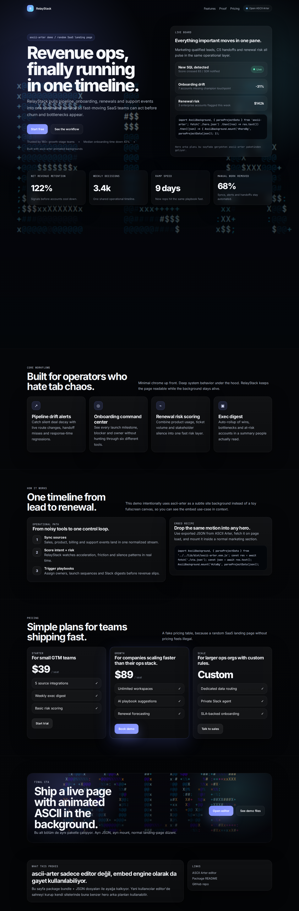
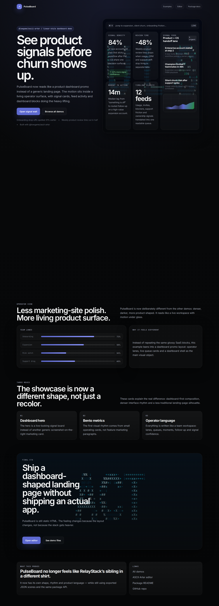
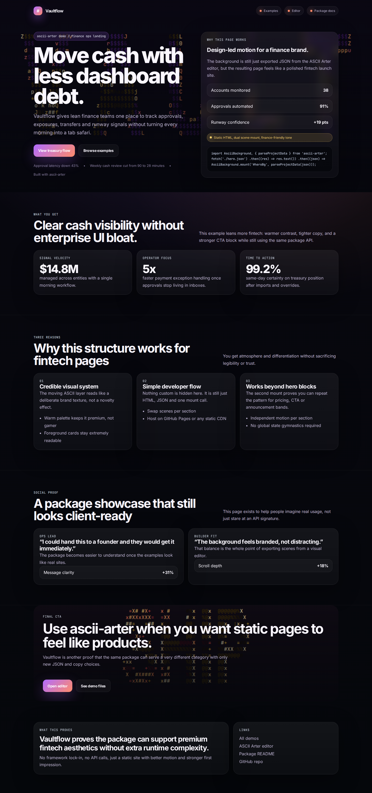

# ASCII Arter

Design animated ASCII scenes in the browser, export them as JSON, and reuse them anywhere.

ASCII Arter has two sides:
- a **visual editor** that runs as a static site
- an **npm package** (`@lowgame/ascii-arter`) that mounts exported scenes onto real websites

## Live links

- **Editor:** https://lowgame.github.io/Ascii-Arter/
- **Examples gallery:** https://lowgame.github.io/Ascii-Arter/examples/
- **npm package:** https://www.npmjs.com/package/@lowgame/ascii-arter
- **Package docs:** [`lib/README.md`](./lib/README.md)

## What it looks like

### RelayStack
[](https://lowgame.github.io/Ascii-Arter/examples/relaystack/)

### PulseBoard
[](https://lowgame.github.io/Ascii-Arter/examples/pulseboard/)

### Vaultflow
[](https://lowgame.github.io/Ascii-Arter/examples/vaultflow/)

## Why this repo is interesting

- **Pure static frontend** — no backend required
- **Visual scene editor** — tune animation, palettes, chars, layers, text, SVG and export JSON
- **Reusable package** — mount exported scenes on any DOM element with `@lowgame/ascii-arter`
- **GitHub Pages friendly** — editor + demos work as plain static files
- **Real showcase pages** — not just toy snippets; there are full landing page examples in `examples/`

## Main features

- 60 built-in animation modes
- layered animation system
- text and SVG-driven subject masks
- custom palettes and character sets
- JSON export/import flow
- PNG export
- embeddable npm package with ESM + CommonJS support
- zero runtime dependencies in the published package

## Repo map

### Editor app
- `index.html` — editor shell
- `css/main.css` — layout and styling
- `js/data/config.js` — defaults and normalization
- `js/data/animations.js` — animation mode definitions
- `js/core/engine.js` — framebuffer + canvas renderer
- `js/core/exporters.js` — import/export helpers
- `js/main.js` — editor runtime and UI bindings

### Package
- `lib/src/` — package source
- `lib/dist/` — built package files
- `lib/README.md` — package documentation used for npm
- `lib/build.mjs` — package build script

### Showcase demos
- `examples/index.html` — examples gallery
- `examples/relaystack/` — revenue ops landing page demo
- `examples/pulseboard/` — product analytics landing page demo
- `examples/vaultflow/` — treasury automation landing page demo
- `assets/screenshots/` — README/demo screenshots

## Package quick start

```bash
npm install @lowgame/ascii-arter
```

```js
import AsciiBackground, { parseProjectData } from '@lowgame/ascii-arter';

const response = await fetch('/hero.json');
const json = await response.text();
const project = parseProjectData(json);

AsciiBackground.mount('#hero', project);
```

For full package docs, examples, API and usage notes:
**see [`lib/README.md`](./lib/README.md)**

## Recommended workflow

1. Open the editor: https://lowgame.github.io/Ascii-Arter/
2. Design the scene visually
3. Export the JSON
4. Save that JSON in your site/app
5. Mount it with `@lowgame/ascii-arter`

## Run locally

```bash
python3 -m http.server 8123
```

Then visit:
- `http://127.0.0.1:8123/` for the editor
- `http://127.0.0.1:8123/examples/` for the demo gallery

## Notes

- Saved presets live in browser `localStorage`
- Exported JSON is portable across browsers and machines
- The examples in this repo are intentionally static so people can copy the pattern into real marketing/product sites
- `.nojekyll` is included so GitHub Pages serves the app as a plain static site

## License

MIT
